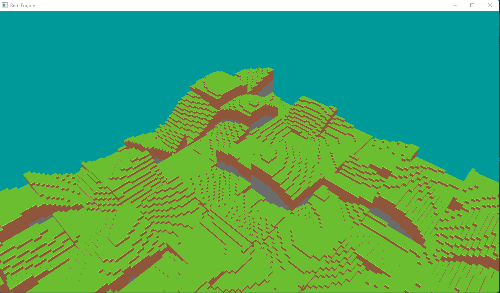

# RemEngine
Rem Engine is a work in-progress Minecraft clone, being written in C++ with OpenGL.

## Building
RemEngine uses CMake, most dependencies should get automatically downloaded for you. Note that it's only been tested
on Windows, it may not build successfully on other platforms .
  
You will need to download stb_image.h from somewhere, and add it to a directory named "external". 
Additionally, you should create a stb_image.cpp file that does the typical stb image define and then includes stb_image.h. You should have two files 
then: external/stb_image.h, external/stb_image.cpp
  
I plan on adding my own repo that has stb_image as a library that I can use FetchContent on with CMake, but for
now manually adding stb_image is a temporary solution.

## Dependencies
- GLFW
- GLAD
- GLM
- STB Image
- FastNoise2
